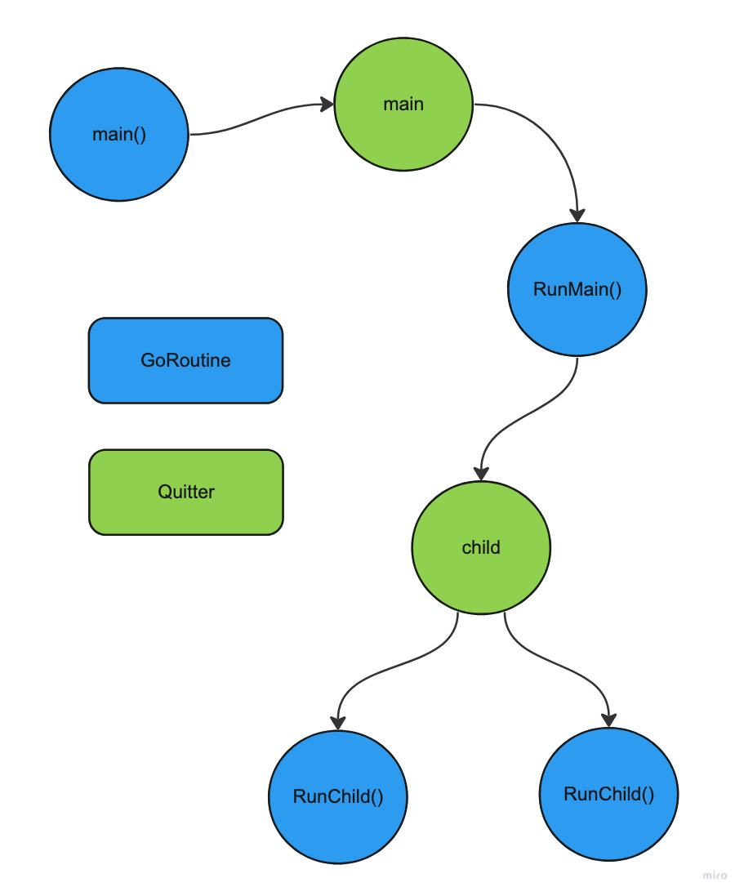

# Heartbeat with child quitter

This example uses the `go-quitter` in a simple heartbeat application with a main and child quitter. First, the main quitter is initiated in the init function `initMainQuitter()`:

```go
func initMainQuitter() (*quitter.Quitter, func()) {
	signalChan := make(chan os.Signal, 1)

	// Listen for OS interrupt signals.
	signal.Notify(signalChan, os.Interrupt)

	// List of channels to listen for quit.
	quitChans := []interface{}{signalChan}

	// For logging purpose, map of quit channels with a description.
	chansMap := make(map[int]string, len(quitChans))
	chansMap[InterruptChanIdx] = "OS interrupt signal"

	// Must use main quitter in the main goroutine.
	mainQuitter, exitFunc := quitter.NewMainQuitter(quitTimeout, quitChans)

	exitMain := func() {
		exitCode, selectedChanIdx, timeouts := exitFunc()
		fmt.Printf("Received quit from channel '%s'\n", chansMap[selectedChanIdx])

		switch exitCode {
		case 0:
			fmt.Println("Sucesfully quit application, all forked goroutines returned")
		case 1:
			fmt.Println("Failed to quit application, not all forked goroutines returned")
			for _, t := range timeouts {
				fmt.Printf("Timeout waiting done on quitter '%s' due to the following goroutines:\n", t.QuitterName)
				for _, gr := range t.GoRoutines {
					fmt.Printf("\t-  %s\n", gr)
				}
				fmt.Printf("\n")
			}
		default:
			fmt.Println("Quitter exit with unknown code", exitCode)
		}

		os.Exit(exitCode)
	}

	return mainQuitter, exitMain
}
```

The purpose of the `go-quitter` is to provide applications with a graceful shutdown mechanism. A set of predefined user events that the main quitter listens to can signal a quit, and as a result, all forked goroutines have to return. Golang channels define the events a main quitter listens to for a quit; there must be at least one channel pass to the main quitter. There is a maximum time the main quitter waits for all forked goroutines to return; the quit timeout parameter determines this. In the init function there is only one event to listen for a quit: 

- `OS interrupt signal`

There is a single `main()` goroutine in any program. In the same case, there can only be a single main quitter; therefore, calling `quitter.NewMainQuitter()` more than once results in a panic. The exit function returned by `quitter.NewMainQuitter()` listens for quit events; if an event is received, the quitter proceeds to signal a quit and waits until all routines have returned. Because of this, the exit function should be called at the end of the main routine.

The logic in the main routine is quite simple. It forks a goroutine to run the main heartbeat, and then calls the exit function at the end. If `q.AddGoRoutine()` returns `false`, the quitter has already received a quit event so the exit function is executed straightway.

```go
func main() {
	mainQuitter, exit := initMainQuitter()

	// If false, quitter has already quitted.
	hb := HeartBeat{name: "main_heartbeat"}
	if ok := mainQuitter.AddGoRoutine(hb.RunMain); !ok {
		exit()
	}

	exit()
}
```

In the heartbeat implementation, the main heartbeat method creates a child quitter using the main one as a parent. This new child quitter forks two goroutines to run the child heartbeat. Next is a for loop that runs until the parent quitter receives a quit event; in this case, it would be an `OS interrupt signal`. In the for loop, after 5 seconds, the child quitter sends a quit event to all forked child heartbeat goroutines. The `.SendQuit()` allows to manually exit the goroutines forked by the child quitter. So after this call, the child heartbeat routines have 2 seconds to return before a timeout occurs.

```go
// Main heartbeat runs forever.
func (hb *HeartBeat) RunMain(parentQuitter quitter.GoRoutineQuitter) {
	// If nil, quitter has already quitted.
	childQuitter := quitter.NewChildQuitter(parentQuitter, "childQuitter")
	if childQuitter == nil {
		return
	}

	// Fork two childs heartbeats on the child quitter.
	// If false, quitter has already quitted.
	childA := HeartBeat{name: "child_heartbeat_a"}
	if ok := childQuitter.AddGoRoutine(childA.RunChild); !ok {
		return
	}
	childB := HeartBeat{name: "child_heartbeat_b"}
	if ok := childQuitter.AddGoRoutine(childB.RunChild); !ok {
		return
	}

	aliveInSec := 1
	for !parentQuitter.HasToQuit() {
		time.Sleep(1 * time.Second)
		fmt.Printf("Heartbeat from '%s'\n", hb.name)

		// Childs should return after 5 seconds.
		if aliveInSec == 5 {
			childQuitter.SendQuit()
			if waitTimeout, _ := childQuitter.WaitDone(2 * time.Second); waitTimeout {
				fmt.Println("Quitter timeout waiting done")
			}
		}

		aliveInSec++
	}
}

// Child heartbeat runs until main send quit.
func (hb *HeartBeat) RunChild(parentQuitter quitter.GoRoutineQuitter) {
	for !parentQuitter.HasToQuit() {
		time.Sleep(1 * time.Second)
		fmt.Printf("Heartbeat from '%s'\n", hb.name)
	}
}
```

Below is a diagram illustrating the workflow between the goroutines and quitters. For the `go-quitter` to provide a graceful shutdown mechanism, there must be a record of the concurrent process running in a system. So the golden rule here is to always fork goroutines via a quitter, from green to blue and never from blue to blue.

