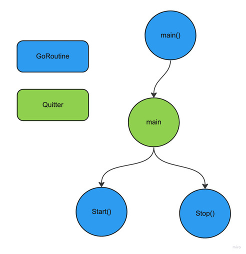

# HTTP Server Graceful Shutdown

In this example you can find a dummy API service that uses the `go-quitter` to easily handle a graceful shutdown of the HTTP server on which the service is running. First, the main quitter is initiated in the init function `initMainQuitter()`:

```go
func initMainQuitter() (*quitter.Quitter, func(), []interface{}) {
	signalChan := make(chan os.Signal, 1)
	serverErrChan := make(chan error, 1)

	// Listen for OS interrupt signals
	signal.Notify(signalChan, os.Interrupt)

	// List of channels to listen for quit
	quitChans := []interface{}{signalChan, serverErrChan}

	// For logging purpose, map of quit channels with a description
	chansMap := make(map[int]string, len(quitChans))
	chansMap[InterruptChanIdx] = "OS interrupt signal"
	chansMap[ServerErrChanIdx] = "Http server error"

	// Must use main quitter in the main goroutine
	mainQuitter, exitFunc := quitter.NewMainQuitter(quitTimeout, quitChans)

	exitMain := func() {
		exitCode, selectedChanIdx, timeouts := exitFunc()
		fmt.Printf("Received quit from channel '%s'\n", chansMap[selectedChanIdx])

		switch exitCode {
		case 0:
			fmt.Println("Sucesfully quit application, all forked goroutines returned")
		case 1:
			fmt.Println("Failed to quit application, not all forked goroutines returned")
			for _, t := range timeouts {
				fmt.Printf("Timeout waiting done on quitter '%s' due to the following goroutines:\n", t.QuitterName)
				for _, gr := range t.GoRoutines {
					fmt.Printf("\t-  %s\n", gr)
				}
				fmt.Printf("\n")
			}
		default:
			fmt.Println("Quitter exit with unknown code", exitCode)
		}

		os.Exit(exitCode)
	}

	return mainQuitter, exitMain, quitChans
}
```

The purpose of the `go-quitter` is to provide applications with a graceful shutdown mechanism. A set of predefined user events that the main quitter listens to can signal a quit, and as a result, all forked goroutines have to return. Golang channels define the events a main quitter listens to for a quit; there must be at least one channel pass to the main quitter. There is a maximum time the main quitter waits for all forked goroutines to return; the quit timeout parameter determines this. In the init function there are two events to listen for a quit: 

- `OS interrupt signal`
- `Http server error`

There is a single `main()` goroutine in any program. In the same case, there can only be a single main quitter; therefore, calling `quitter.NewMainQuitter()` more than once results in a panic. The exit function returned by `quitter.NewMainQuitter()` listens for quit events; if an event is received, the quitter proceeds to signal a quit and waits until all routines have returned. Because of this, the exit function should be called at the end of the main routine.

The logic in the main routine is clean and straightforward. It forks two goroutines for starting and stopping the service and then calls the exit function at the end. If `q.AddGoRoutine()` returns `false`, the quitter has already received a quit event so the exit function is executed straightway.

```go
func main() {
	q, exit, chans := initMainQuitter()
	srv := NewService("8080", chans[ServerErrChanIdx].(chan error))

	// If quitter has already quit, a new goroutine cannot be added,
	// so .Stop() is registered first in cases .Start() cannot be added
	if ok := q.AddGoRoutine(srv.Stop); !ok {
		exit()
	}

	if ok := q.AddGoRoutine(srv.Start); !ok {
		exit()
	}

	exit()
}
```

As for the service logic, it's also quite simple. There are two routines to handle the HTTP server's start/stop; the only thing to look at here is listening to the quit channel in `.Stop()`. The quit channel holds the execution of this routine until a quit event, such as `OS interrupt signal`, is received.

```go
func (s *APIService) Start(q *quitter.Quitter) {
	fmt.Println("Starting service")
	s.errChan <- s.ListenAndServe()
}

func (s *APIService) Stop(q *quitter.Quitter) {
	// Wait for quitter to quit
	<-q.QuitChan()

	ctx, cancel := context.WithTimeout(context.Background(), shutdownTimeout)
	defer cancel()

	fmt.Println("Stopping service")

	if err := s.Shutdown(ctx); err != nil && !errors.Is(err, http.ErrServerClosed) {
		fmt.Println("Failed to shutdown server gracefully", err)
		if err := s.Close(); err != nil {
			fmt.Println("Failed to close server", err)
		}
		return
	}

	fmt.Println("Stopped service successfully")
}
```

Below is a diagram illustrating the workflow between the goroutines and the main quitter. For the `go-quitter` to provide a graceful shutdown mechanism, there must be a record of the concurrent process running in a system. So the golden rule here is to always fork goroutines via a quitter, from green to blue and never from blue to blue.

<p align="center">
  
</p>